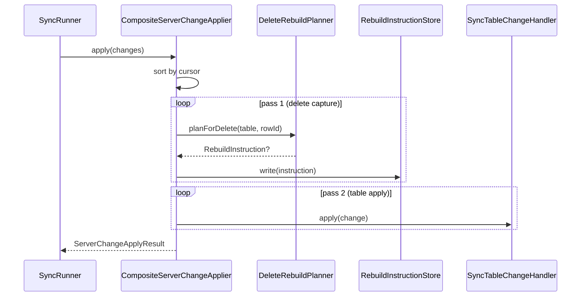

# Architecture

This document describes the design and runtime behavior of the `cqrs_offline_sync` sync pipeline. It is adapted from the production sync-v2 system used in the Lateinorum app.

## Overview

The library implements **Option B** offline-first sync:

- Local domain writes produce typed **commands**.
- Commands are appended to a local **outbox** with cursor context.
- A **scheduler** or **write-commit hook** triggers a sync run.
- One **push/pull batch** is sent to the server.
- Returned **server changes** are applied to local tables in cursor order.
- **Stale conflicts** are resolved automatically via profiles and, when necessary, **rebuild planning**.

The package is **host-agnostic**: it defines interfaces for persistence, transport, and table handlers, which the host app implements using its own database and HTTP client.

## Pipeline phases

A single sync run (`SyncRunner.runOnce`) executes the following phases:

1. **Prepare batch** (`SyncUnitOfWork.prepareBatch`)
   - Recover abandoned `inFlight` rows back to `pending`
   - Read `lastServerCursor` and `syncEpoch`
   - Select pending/failed outbox rows up to a batch limit
   - Mark selected rows as `inFlight`
   - Build `PreparedSyncBatch` (request DTO)

2. **Transport** (`SyncTransport.pushPull`)
   - Serialize request with `CommandCodecRegistry`
   - POST to server endpoint
   - Parse `SyncBatchResponse` (command results + changes + new cursor + hasMore)

3. **Apply changes** (`CompositeServerChangeApplier.apply`)
   - Sort changes by cursor ascending
   - Pass 1: capture delete-rebuild instructions via `DeleteRebuildPlanner`
   - Pass 2: dispatch each change to the correct `SyncTableChangeHandler`

4. **Resolve stale conflicts** (`ConflictResolver.resolve`)
   - For each `rejected_conflict_stale` result, look up the command's `StaleConflictProfile`
   - Profile decides: `ack`, `replay` same payload, or `rebuild` from instructions
   - Build `ConflictResolutionPlan` with per-command actions

5. **Commit results** (`SyncUnitOfWork.commitResolved` / `commitFailure`)
   - Ack successful / noop / invalid commands
   - Requeue replayed / rebuilt commands with fresh envelopes and current base cursor
   - Mark retryable errors as `failed` with retry metadata
   - Advance `lastServerCursor` monotonically

6. **Continue pulling** (if `hasMore=true` or stale results require a higher cursor)
   - Loop additional pull-only pages until convergence requirements are met

## Outbox semantics

### Row lifecycle

- `pending` — ready to send
- `inFlight` — reserved by `prepareBatch`
- `acked` — terminal (applied, noop, rejected_invalid, or resolved stale)
- `failed` — retryable; eligible again when `nextAttemptAtUtc <= now`

### Retry behavior

- `attempts`, `lastAttemptAtUtc`, `lastError` updated on failure
- Default retry delay is host-defined (commonly 30s)

### Rebuild context

- Optional local-only JSON stored next to an outbox command (`rebuild_context_json`)
- Used by stale conflict profiles when replaying the original payload is not enough
- **Not sent to the server** — it is private seed data for client-side reconstruction
- Example: a stale update where the target row no longer exists after pull; the profile can rebuild an equivalent create/recreate chain

## Change application (two-pass)

The two-pass model is intentional:

1. **Delete capture** must happen **before** local rows are removed, so that stale recovery can rebuild lost subtrees.
2. **Table mutation** still happens in deterministic cursor order.

## Conflict resolution model

### Principles

1. **Server-authoritative LWW** for normal sync conflicts
   - Canonical order: server feed cursor
   - Client command carries `baseCursor`; server rejects as stale if changes exist after that cursor
2. **User choices only at auth boundaries** (login divergence, logout keep/delete, delete account)
3. **Automatic stale resolution loop**
   - Pull to at least `latestCursor` returned by server
   - Apply pulled changes in cursor order
   - Recompute desired domain state from current local user intent
   - If desired state still differs, enqueue a **new** command with fresh `opId` and `baseCursor = current local cursor`

### Stale profile contract

Each command type may register a `StaleConflictProfile` that answers:

- **Should we ack?** — desired state already achieved after pull
- **Should we replay?** — same payload is still valid from a fresh base
- **Should we rebuild?** — use captured rebuild instructions to recreate lost subtrees
- **Should we fail?** — resolution cannot be safely derived

### Rebuild mechanics

When a delete removes a parent that a stale command references, the `DeleteRebuildPlanner` (backed by a `RebuildGraph`) produces `RebuildInstruction`s that describe how to recreate the lost subtree. During stale resolution, the profile consumes these instructions and emits new commands that restore the intended state.

## Auth boundary local data scopes

`LocalDataScope` is the contract for per-module data boundaries during auth transitions:

- `id` — stable string identifier (e.g. `'vocab_trainer'`)
- `hasData()` — whether this scope contains local rows
- `clear()` — remove all local data for this scope

The host app collects all `LocalDataScope`s and uses them to:

- Detect whether login should show a divergence chooser
- Implement "keep local and upload" vs "get server data"
- Implement logout "keep local" vs "delete local"
- Implement delete-account purge

## Module registration

Every syncable module provides one `SyncModuleRegistration` that exposes:

- `moduleId` — diagnostic name
- `commandCodecs` — outbox serialization codecs
- `tableChangeHandlers` — pull-side feed handlers
- `staleConflictProfiles` — stale resolution policies
- `localDataScope` — auth-boundary data operations
- `rebuildGraph` — delete-rebuild structural graph

The host app collects all registrations and passes them to:
- `CommandCodecRegistry` (codecs)
- `CompositeServerChangeApplier` (handlers)
- `ConflictResolver` (profiles)
- `SyncAuthFlowService` (scopes)
- `DeleteRebuildPlanner` (graphs)

## Transport contracts

### Request shape (`SyncBatchRequest`)

- `sinceCursor` — last known server cursor
- `commands` — serialized `CommandEnvelope` list
- `pull.enabled` — whether client wants downstream changes
- `pull.limit` — max changes per page

### Response shape (`SyncBatchResponse`)

- `commandResults` — per-op result (`applied`, `noop_already_applied`, `rejected_conflict_stale`, `rejected_invalid`, `retryable_error`)
- `changes` — server feed changes (`upsert` / `delete`)
- `newCursor` — highest cursor in this response
- `hasMore` — whether additional pull pages exist
- `resyncRequired` + `expectedSyncEpoch` — signals full reset required

## Bootstrap replace (device-wins auth flow)

When the user chooses "keep local and upload", the host app:

1. Reads all `RebuildGraph` nodes
2. Calls `loadAll()` and `toSnapshot()` on each node to produce table-level data
3. Builds `SyncBootstrapReplaceRequest` with `snapshot` + `expectedSyncEpoch`
4. Sends to server via `SyncTransport` or a dedicated bootstrap-replace client
5. Server replaces the account dataset atomically and returns `SyncBootstrapReplaceResponse`

## Extensibility boundaries

The package intentionally leaves the following to the host app:

- **Database implementation** — Drift, Hive, SQLite, etc.
- **HTTP client** — Supabase, Dio, http, etc.
- **Conflict resolver default** — the package provides the generic `ConflictResolver` contract; the host app injects a concrete implementation (e.g. `DefaultConflictResolver` with a profile registry)
- **Trigger sink scheduling** — the package defines `SyncTriggerSink`; the host app implements scheduling (startup, resume, interval, auth)
- **Command envelope factory defaults** — the host app decides whether to use `UuidOpIdGenerator`, `SystemUtcClock`, or custom implementations
